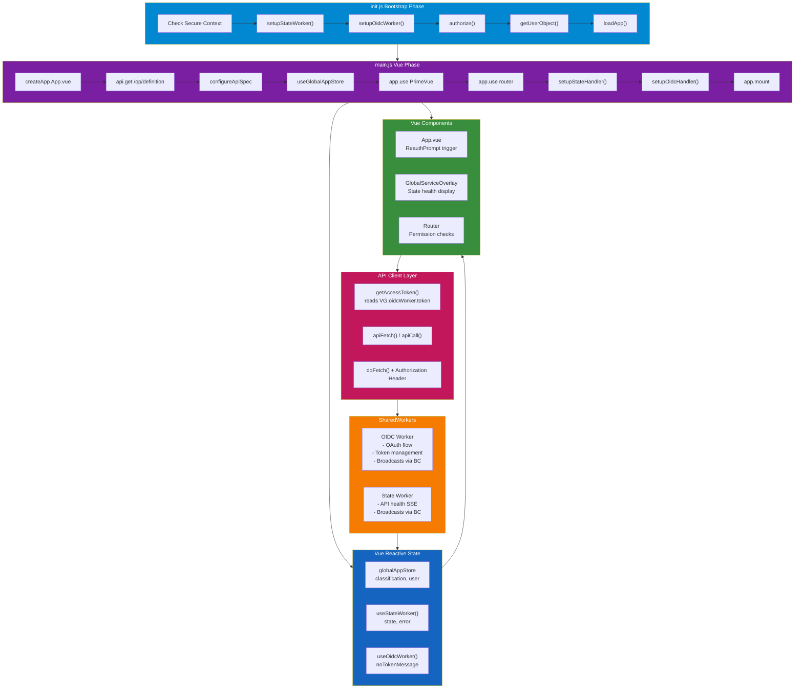
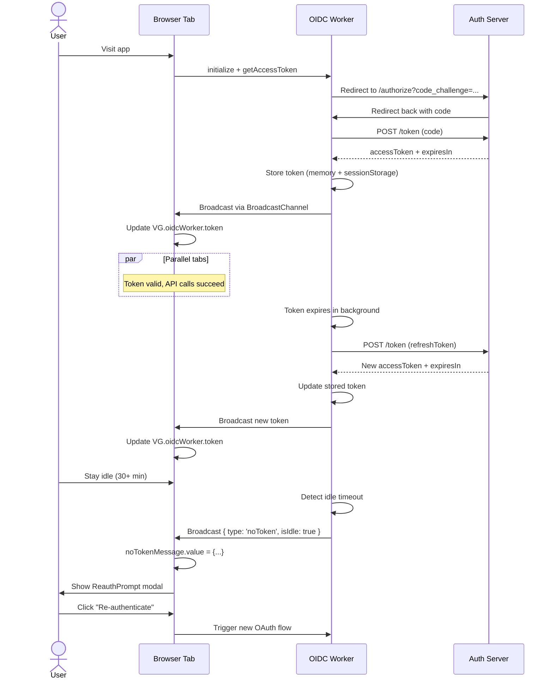

# Client Initialization and Data Flow Architecture

## Overview

The Village Green Vue 3 client follows a multi-stage initialization process orchestrated by `init.js`, which sets up authentication, state management, and API communication before loading `main.js`. The architecture heavily relies on **SharedWorkers** for token management and state synchronization, **BroadcastChannels** for cross-tab messaging, and **Vue 3 Pinia-like stores** for global state.

---

## Initialization Sequence

### Stage 1: `init.js` Startup (Pre-Vue)

**File:** `client/src/init.js`

This file runs before Vue is initialized and handles:

1. **Environment Setup**
   - Configures `VG.Env.apiBase` from environment variables or current location
   - Validates secure context requirement (HTTPS)
   - Sets up loading UI with status messages

2. **State Worker Setup** (`setupStateWorker()`)
   - Creates a `SharedWorker` for streaming API state updates
   - Initializes worker with `apiBase` and receives initial state
   - Opens `BroadcastChannel` for state messages from the worker
   - Waits for API to reach `available` state before proceeding
   - **Key:** If `VG.Env.stateEvents` is false, this is skipped entirely

3. **OIDC Worker Setup** (`setupOidcWorker()`)
   - Creates a `SharedWorker` for OIDC token management
   - Initializes worker with OAuth configuration and redirect URIs
   - Retrieves or creates a `BroadcastChannel` for token updates
   - Worker maintains tokens in `VG.oidcWorker.token` and `VG.oidcWorker.tokenParsed`

4. **Authorization Flow** (`authorize()`)
   - Checks for OAuth redirect parameters (code) in URL
   - **If code present:** Exchanges code for token via worker
   - **If no code:** Requests new access token or triggers OIDC redirect
   - Stores state/code-verifier in `sessionStorage` for security
   - Updates `VG.oidcWorker.token` when successful

5. **User Profile Fetch** (`getUserObject()`)
   - Raw fetch call to `/user?projection=webPreferences`
   - Uses `VG.oidcWorker.token` in `Authorization` header
   - Sorts village grants by name
   - Returns user object containing `villageGrants` array

6. **App Loading** (`loadApp()`)
   - Removes loading mask from DOM
   - Dynamically imports `main.js` via `import('./main.js')`

### Stage 2: `main.js` Startup (Vue Initialization)

**File:** `client/src/main.js`

Once imported, this file:

1. **Creates Vue App**
   - Calls `createApp(App)` with root component
   - Sets global error handler that triggers reactive error state

2. **Configures API Client**
   - Calls `api.get('/op/definition')` to fetch OpenAPI spec
   - Configures `apiSpecObj` for operation-based API calls
   - **Key:** This is the FIRST actual API call in the app

3. **Sets Global State**
   - Uses `useGlobalAppStore()` to set classification and user object
   - Classification comes from `VG.Env.classification`
   - User was already fetched in `init.js` and stored in `VG.curUser`

4. **Installs Plugins**
   - PrimeVue with theme configuration
   - Router with history-based navigation
   - Provides OIDC worker via `app.provide('worker', VG.oidcWorker)`

5. **Sets Up Message Handlers**
   - `setupStateHandler()` — listens to state worker messages via BroadcastChannel
   - `setupOidcHandler()` — listens to OIDC worker token changes via BroadcastChannel
   - Both are composables that export Vue `ref()`s for reactive state

6. **Mounts App**
   - `app.mount('#app')` attaches Vue to the DOM

---

## API Call Flow

### Token Management

**How tokens are obtained:**

1. **Initial Setup:** `init.js` → `setupOidcWorker()` → `authorize()`
   - Requests access token from OIDC worker
   - Worker handles OAuth flow, token refresh, and expiry
   - Token stored in `VG.oidcWorker.token` (in-memory)

2. **Token Retrieval:** Every API call reads from `VG.oidcWorker.token`
   - **File:** `client/src/shared/api/apiClient.js`
   - Function: `getAccessToken()` → `() => VG.oidcWorker.token`
   - Called in `apiFetch()` to add `Authorization: Bearer <token>` header

3. **Token Updates:** Worker broadcasts token changes via BroadcastChannel
   - Worker publishes `{ type: 'accessToken', accessToken, accessTokenPayload }`
   - Both `init.js` (during bootstrap) and `useOidcWorker()` (in-app) listen
   - Updates to `VG.oidcWorker.token` are immediate (synchronous)

### API Call Patterns

**File:** `client/src/shared/api/apiClient.js`

Three main approaches:

#### 1. **Operation-Based Calls** (Recommended)
```javascript
// Uses OpenAPI spec to build URLs and methods
apiCall('getStigById', { id: 1 })
apiCall('createCollection', { }, { name: 'Test' })
```
- Requires API spec to be configured (done in `main.js`)
- Routes through `apiCall()` → `apiFetch()` → `doFetch()`
- Automatically includes token

#### 2. **Path-Based Calls**
```javascript
api.get('/op/definition')
api.post('/user', { name: 'John' })
api.del('/collection/5')
```
- Direct HTTP verbs (get, post, put, patch, del)
- Routes through `apiFetch()` → `doFetch()`
- Automatically includes token

#### 3. **Raw Fetch** (Bootstrap Only)
```javascript
// In init.js
fetch(`${VG.Env.apiBase}/user?projection=webPreferences`, {
  headers: { Authorization: `Bearer ${VG.oidcWorker.token}` }
})
```
- Manual header management
- Used during initialization before API client is configured

### Error Handling

**File:** `client/src/shared/api/apiClient.js`

- Non-OK responses throw `ApiError` with `status`, `url`, and `body` properties
- Error handler in `main.js` triggers global error store
- Consumers (components) wrap calls in `useAsyncState()` to handle errors reactively

---

## State Management Architecture

### Global Stores (Vue Reactive Objects)

#### 1. **globalAppStore**
- **File:** `client/src/shared/stores/globalAppStore.js`
- **State:** `classification`, `user`
- **Populated:** In `main.js` before mount
- **Lifetime:** For duration of session
- **Updates:** Manual via setters, not reactive to server changes

#### 2. **globalAuthStore** (Unused)
- **File:** `client/src/shared/stores/globalAuthStore.js`
- **State:** `noTokenMessage`
- **Note:** Currently unused; `useOidcWorker()` composable returns `noTokenMessage` ref instead

### Worker-Based Reactive State

#### 1. **State Worker** (`useStateWorker()`)
- **File:** `client/src/auth/useStateWorker.js`
- **Exports:** Two `ref()` values
  - `state` — current API/database state object
  - `error` — error messages from state streaming
- **Updates:** Listen to worker BroadcastChannel
  - Message types: `'state-changed'`, `'state-report'`, `'state-error'`
  - Auto-parses JSON in `eventMessage.data`
- **Triggered by:** `setupStateHandler()` in `main.js`
- **Consumed by:** `GlobalServiceOverlay.vue` (likely displays health status)

#### 2. **OIDC Worker** (`useOidcWorker()`)
- **File:** `client/src/auth/useOidcWorker.js`
- **Exports:** One `ref()` value
  - `noTokenMessage` — triggers re-authentication prompt
- **Updates:** Listen to worker BroadcastChannel
  - Message type: `'noToken'` when token expires or becomes invalid
  - Includes `isIdle` and `clientV2` data for re-auth flow
- **Triggered by:** `setupOidcHandler()` in `main.js`
- **Consumed by:** `App.vue` renders `<ReauthPrompt>` when non-null

---

## SharedWorker Architecture

### OIDC Worker (`workers/oidc-worker.js`)

**Responsibilities:**
- Manages OAuth 2.0 authorization code flow
- Stores and refreshes access tokens
- Detects token expiry and idle timeouts
- Broadcasts token updates to all tabs
- Handles logout

**Communication Pattern:**
1. **Request-Response** via `sendWorkerRequest()`
   - Message format: `{ request: 'getAccessToken', requestId, ...params }`
   - Worker responds: `{ response: {...}, requestId }`
   - Uses UUID-based request ID for correlation

2. **Broadcast** via BroadcastChannel
   - Publishes token updates to dynamic channel name
   - Channel name provided by worker after initialization
   - All tabs receive token changes automatically

**Key Methods Called from `init.js`:**
- `getStatus()` — check if worker is initialized
- `initialize(...)` — set up OAuth config, redirect URI, OIDC metadata
- `getAccessToken(redirectUri)` — get token (or redirect for auth)
- `exchangeCodeForToken(...)` — exchange OAuth code for token
- `logout()` — clear token and redirect to logout URL

### State Worker (`workers/state-worker.js`)

**Responsibilities:**
- Connects to server-sent events (SSE) for API state changes
- Broadcasts state updates to all tabs
- Handles connection errors and reconnects

**Communication Pattern:**
1. **Request-Response:**
   - Message: `{ request: 'initialize', apiBase }`
   - Response: `{ state: JSON.stringify(stateObj), channelName, error? }`

2. **Broadcast via BroadcastChannel:**
   - Publishes: `{ type: 'state-changed'|'state-report'|'state-error', data }`
   - Channel name provided by worker

---

## Component-Level Integration

### ReauthPrompt.vue
- **Trigger:** `noTokenMessage.value !== null`
- **Props:** `redirectOidc`, `codeVerifier`, `state`
- **Action:** Shows modal, initiates OIDC redirect on user interaction
- **Side Effects:** Modifies window location

### GlobalServiceOverlay.vue
- **Trigger:** Listens to state worker via `useStateWorker()`
- **Action:** Displays API health status (database, OIDC availability)
- **Side Effects:** Blocks UI if API is unavailable
- **Note:** Only active if `VG.Env.stateEvents` is enabled

### Router Integration
- **Navigation Guard:** `navigationGuard()` in `client/src/router/navigationGuards.js`
- **Checks:** Collection grants, admin status, route requirements
- **Uses:** `VG.curUser` from bootstrap to validate permissions

---

## Request Flow Diagram



---

## Cross-Tab Synchronization

### Token Sync
1. **Tab A:** Token expires, OIDC worker refreshes it
2. **Worker:** Publishes `{ type: 'accessToken', accessToken, ... }` to BroadcastChannel
3. **Tab B:** `setupOidcHandler()` listener receives message
4. **Tab B:** Updates `VG.oidcWorker.token` in-memory
5. **Tab B:** Next API call automatically uses new token

### State Sync
1. **Any Tab:** API state changes (e.g., database comes online)
2. **State Worker:** Receives SSE event, publishes to BroadcastChannel
3. **All Tabs:** `setupStateHandler()` listener receives message
4. **All Tabs:** Updates `state.value` ref (reactive)
5. **UI:** Components watching `state.value` update automatically

---

## Key Design Patterns

### Pattern 1: Global Singleton Access
- **OIDC Worker:** Accessed via `VG.oidcWorker` global variable
- **State Worker:** Accessed via `VG.stateWorker` global variable
- **Environment:** Accessed via `VG.Env` global object
- **Rationale:** Shared across bootstrap, Vue, and components without prop drilling

### Pattern 2: BroadcastChannel for Cross-Tab Messaging
- **Workers** publish updates to `BroadcastChannel` with dynamic channel names
- **Vue composables** listen to these channels and update reactive `ref()`s
- **Components** consume composables and re-render on updates
- **Advantage:** All tabs stay synchronized without server polling

### Pattern 3: Request-Response with UUID Correlation
- **Caller:** `{ request: 'xyz', requestId: 'uuid-1234', ...params }`
- **Worker:** Processes and responds `{ response: {...}, requestId: 'uuid-1234' }`
- **Caller:** Matches response to original request by UUID
- **Advantage:** Multiple concurrent requests don't collide

### Pattern 4: Lazy Vue Import
- **Bootstrap:** Runs first, sets up workers and state
- **Bootstrap:** Dynamically imports `main.js` after readiness
- **Rationale:** Vue doesn't load until all preconditions are met
- **Benefit:** Cleaner separation of concerns between bootstrap and app

---

## Potential Issues / Hybrid Code State

This codebase is a **merge of STIGMAN (ExtJS client) and VG (Vue client)** architectures:

1. **State Management Inconsistency**
   - `globalAuthStore` exists but is unused; `useOidcWorker()` composable is the actual source
   - `globalAppStore` is populated but rarely consumed
   - No centralized store pattern (no Pinia)

2. **Token Handling Asymmetry**
   - `init.js` uses raw `fetch()` to get user object
   - `main.js` and components use `apiClient` with auto-token injection
   - Both access the same `VG.oidcWorker.token` reference

3. **API Configuration**
   - OpenAPI spec fetched in `main.js` (not in `init.js`)
   - Early API calls in bootstrap don't use `apiCall()` — must use `apiFetch()` with manual headers
   - Creates brittleness if spec is needed during bootstrap

4. **State Worker Optional**
   - Can be disabled via `VG.Env.stateEvents = false`
   - Components expecting state health info should gracefully handle null
   - BroadcastChannel setup is conditional but listeners aren't

---

## Access Token Lifecycle



---

## Summary

The client architecture is **worker-centric** and **cross-tab aware**:

- **Bootstrap** (`init.js`) sets up workers, authorizes, and fetches initial data before Vue loads
- **Vue App** (`main.js`) consumes worker state via reactive composables and BroadcastChannel listeners
- **API Calls** automatically include tokens from `VG.oidcWorker.token`
- **State Updates** (tokens, API health) broadcast to all tabs via BroadcastChannels
- **Components** remain stateless and consume reactive refs from composables
- **No polling** — all updates are event-driven via workers and BroadcastChannels

The codebase shows signs of **STIGMAN → VG migration** (unused stores, dual token access patterns), but the current flow is functional and follows Vue 3 composition API patterns.
